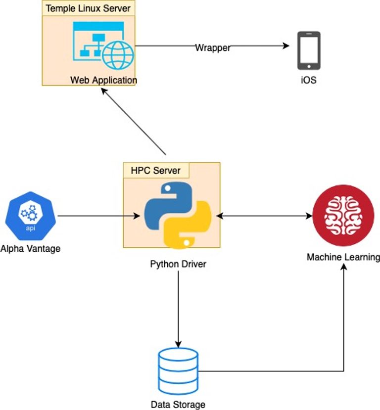

# Stocks
Capstone Projects Spring 2020: Stock Predictor

TIKR is a machine learning application that predicts stock fluctuations based on historical data. The application takes a range of financial data as input using API calls provided by Alpha Vantage. It then utilizes python libraries scikit-learn and Keras for generating, training, and testing the models used to make the actual predictions

**Design and Architecture**

- Application design was split into two parts
- The frontend is a web application hosted on Temple’s cis-linux2 server that takes user input to search for our generated stock predictions stored by our python driver on the backend
- The backend was composed of different machine learning models used to generate these predictions. These models included utilizing K-nearest neighbor (kNN) algorithm, linear regression, and an RNN algorithm using LSTM.

**Features**
- User Account Management
- Stock search  tool that shows information regarding real-time stock data, 10-day generated predictions, and day to day accuracies
- Trending Stock
- Stock Correlation Pages

**Results**

Generated stock predictions are reasonably accurate given current conditions of the stock market with day to day average accuracies of close to 73% across 3000 stocks. 
For a comparison, our first model had an accuracy of around 56%

**Future Contributationa and Challenges to Solve**
- Machine Learning Model Optimization
- Data Storage Connections
- Troubleshooting User Account Features

